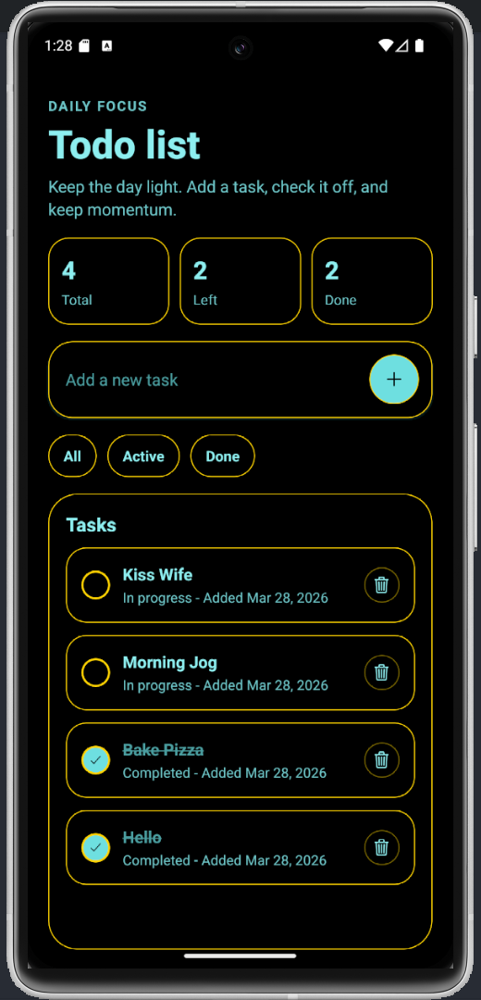
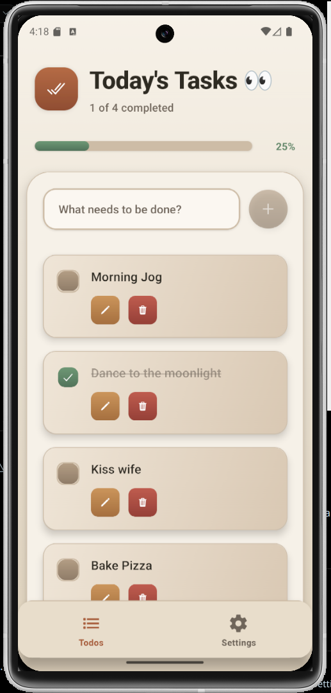
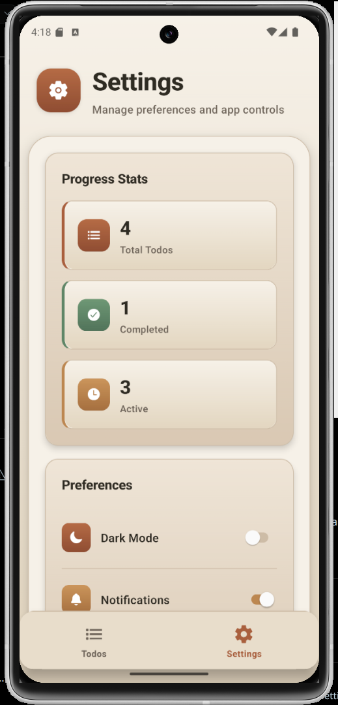
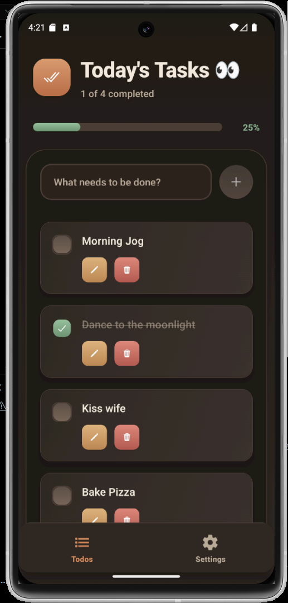
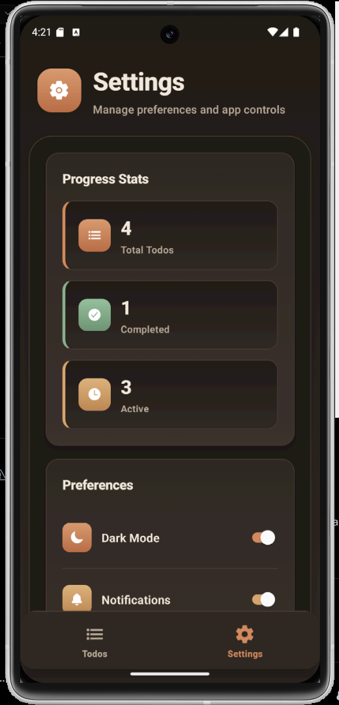

# Expo Todo App - Version 1 and Version 2

This project documents the evolution of the same todo app across two versions:

- Version 1: single-page app with local AsyncStorage persistence
- Version 2: online Convex database, tabbed navigation, and dark mode support

## Version comparison

| Area            | Version 1             | Version 2                                     |
| --------------- | --------------------- | --------------------------------------------- |
| Data storage    | Local `AsyncStorage`  | Online `Convex` database                      |
| App structure   | Single page           | Tabbed pages (Home + Settings)                |
| Theme support   | Default single theme  | Light/Dark mode toggle                        |
| Todo operations | Add, complete, delete | Add, complete, edit, delete                   |
| Extra tools     | Basic todo list       | Progress stats, preferences, reset-all action |

## Version 1 features

- Single-page todo experience
- Add, complete, and delete tasks
- Local persistence with AsyncStorage
- Lightweight and offline-friendly flow

## Version 2 features

- Convex-powered online data layer
- Tab-based navigation with Home and Settings screens
- Inline todo editing with save/cancel controls
- Dark mode and theme toggle support
- Progress dashboard (Total, Completed, Active)
- Preferences panel and danger zone reset action
- Updated visual style with gradient surfaces and polished cards

## Tech stack

- Expo
- React Native
- TypeScript
- Expo Router
- AsyncStorage (Version 1)
- Convex
- Convex React
- Expo Vector Icons
- Expo Linear Gradient

## Demo images

<table>
  <tr>
    <td align="center">
      
    </td>
    <td align="center">
      
    </td>
    <td align="center">
      
    </td>
    <td align="center">
      
    </td>
    <td align="center">
      
    </td>
  </tr>
  <tr>
    <td align="center"><em>Version 1</em></td>
    <td align="center"><em>Version 2 - Home (Light)</em></td>
    <td align="center"><em>Version 2 - Settings (Light)</em></td>
    <td align="center"><em>Version 2 - Home (Dark)</em></td>
    <td align="center"><em>Version 2 - Settings (Dark)</em></td>
  </tr>
</table>

## Getting started

1. Install dependencies

    ```bash
    npm install
    ```

2. Start Convex in development mode (Version 2 backend)

```bash
npx convex dev
```

3. Start the Expo development server (new terminal)

    ```bash
    npm run start
    ```

4. Run on your preferred platform

    ```bash
    npm run android
    npm run ios
    npm run web
    ```
